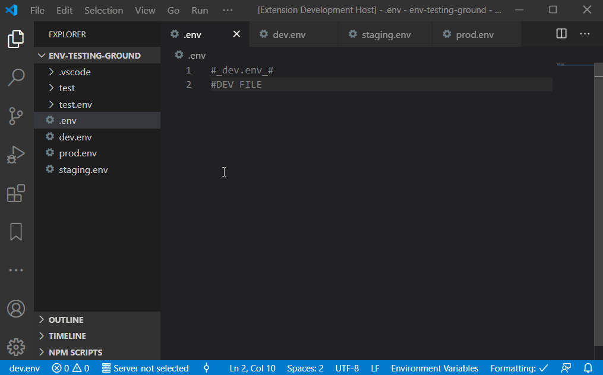

# .ENV Switcher

Status bar extension that swaps(**overwrites**) the target file(`.env` by default) from provided presets. This means that the target file is a placeholder for presets.

**It's strongly advised to backup your target file (`.env`) before using this extension.**

## Features

- Displaying the currently selected preset in status bar.
- Ability to switch to another preset from the status bar.
- Warning in the status bar if the selected preset is matching a configurable regex pattern is selected. Matching `prod` by default.

<p align="center">
  
</p>

## Semi-shameless plug

<a href='https://ko-fi.com/N4N8O4KNX' target='_blank'></a> [](https://ecksdy.com)

## Requirements

- For the status bar button to show, a file matching the target glob must be found in the workspace.
  - The `envSwitcher.glob.target` default is `**/.env`.
  - The `envSwitcher.glob.targetExclude` default is `**/node_modules/**`.
- To see presets when you click on the button or use the `.ENV Switcher: Select preset` command, files matching the presets glob must be found in the workspace.
  - The `envSwitcher.glob.target` default is `**/*.env`.
  - The `envSwitcher.glob.targetExclude` default is `**/node_modules/**`.

The default configuration will match any of the following presets in the workspace, as long as they're not in `node_modules` directory:

```list
/dev.env
/presets/Staging.env
/sub-dir/PRODUCTION.env
/very/nested/sIlLy_EXAmple123.env
```

_Don't forget to check that your `.gitignore` is still valid for these `.envs`_

## Planned

In no particular order.

### Multi-root Workspace / Mono-repo support

- [ ] `.envswitcher` files - for monorepos
  - [ ] Detect
  - [ ] Parse
  - [ ] Watch
- [ ] Handle multi-root workspaces
  - [x] Integrate with UI
  - [ ] Handle more than one workspace folder
- [ ] Handle overrides for multi-root workspaces
- [ ] Webview UI for selecting presets
  - [x] UI design
  - [x] Setup svelte (otherwise too hard to maintain)
  - [ ] Multi target switch
    - [ ] Ability to lock projects
  - [ ] Nested trees for m.workspaces that have monorepo folders
  - [ ] Preview file contents
- [ ] Add tests

### Tasks

- [ ] Fix issue with dev/master branch out of sync
- [ ] Trigger CI/CD on new tags
- [x] Add DI container
- [x] Add CI for pull requests
- [x] Add UI tests

## FAQ

### Why my target file is not detected?

- Make sure `envSwitcher.glob.target` is set to the correct glob pattern.
- Make sure `envSwitcher.glob.targetExclude` is set to the correct glob pattern.

### My presets are not detected, why?

- Make sure `envSwitcher.glob.presets` is set to the correct glob pattern.
- Make sure `envSwitcher.glob.presetsExclude` is set to the correct glob pattern.

For people preferring `.env.preset-name` naming convention, change the `envSwitcher.glob.presets` to `**/.env.*`

### I've added the target file, but the status bar button is not showing, why?

Extension will not start if no target was found when the directory was first opened.

- Ensure the target file would be found by the glob specified in `envSwitcher.glob.target` setting.
- Reload the window via `Developer: Reload Window` command.

### Will you support monorepos / multiroot workspaces?

There is currently a solution in the works:
Phase 1 - support multiroot workspaces.
Phase 2 - support monorepos.
Phase 3 - support monorepos inside multiroot workspaces. While questionable, should be relatively easy to implement on top of phase 2.

If you'd like to help with an idea or join the discussion you can do that in:

- [Support multiroot workspaces](https://github.com/EcksDy/vscode-env-switcher/issues/17)
- [Discussing a UI solution for multiroot/monorepo workspaces](https://github.com/EcksDy/vscode-env-switcher/issues/41).

### How can I turn off the warning in the status bar?

Set `envSwitcher.warning.regex` to an empty string.

### Can I change the status bar button position?

There isn't a way to set an exact position on the status bar, the options on `envSwitcher.statusBarPosition` are what the VSCode API allows.

### Does it work with WSL?

Personally, I've tried it on WSL 2 and I haven't had any issues.
.
