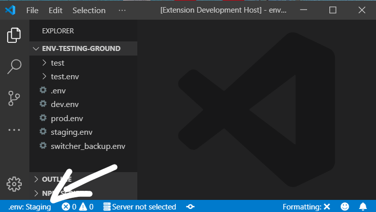
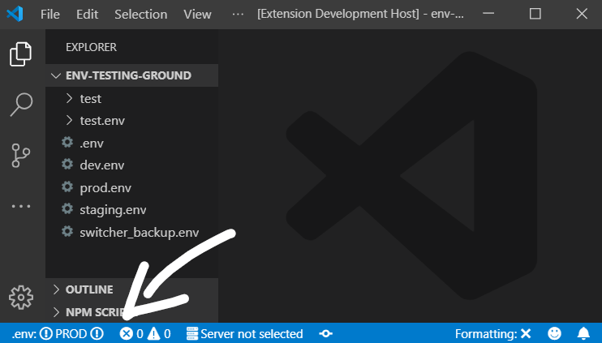
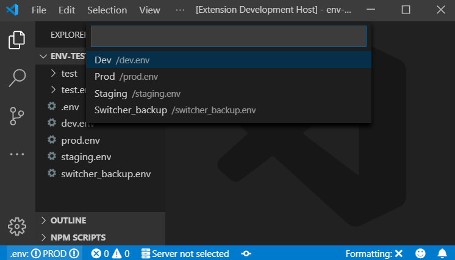

# .ENV Switcher

Status bar extension that shows the current content of `.env` file and allows to swap (**overwrite**) `.env` files on click from the status bar.

## Features

Showing the currently selected `.env` preset in status bar:

Status bar will change appearance if preset contains "prod" in its name:

Clicking the status bar button will bring up a prompt to switch the contents of the main `.env` file with the selected preset:

## Requirements

A set of preset files must exist in the root of the project. `.env` file must be
Preset file name should be matching the `*.env` glob pattern, i.e.:

- `dev.env`
- `Staging.env`
- `PRODUCTION.env`
